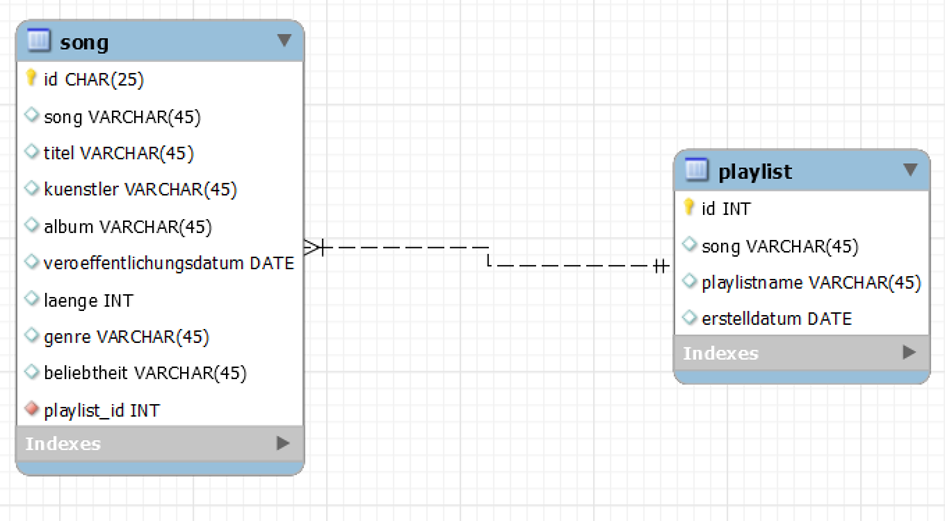
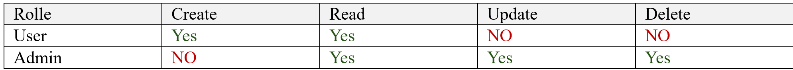

# Musicmanager
m295
## Beschreibung
Dieses Projekt ist eine Spring Boot-basierte REST-API zur Verwaltung von Musikplaylists und Songs. Es ermöglicht das Erstellen, Lesen, Aktualisieren und Löschen (CRUD-Operationen) von Playlists und Songs. Die API nutzt Spring Security für die Zugangskontrolle, JPA/Hibernate für die Datenpersistenz und Validierung, sowie MySQL als Datenbank.
Die API ist Teil des m295-Projekts von Lara Corrodi und dient als Backend-System für eine Musikverwaltungsanwendung.

## Datenbankdiagramm, Klassendiagramm, Screenshot der Testdurchführung

## Validierungsregeln
In der Playlist-Entität sind folgende Validierungsregeln definiert:

1. **Playlistname** (String):  
   Maximal 50 Zeichen lang.

2. **Songname** (String):  
   Darf nur aus Buchstaben (A-Z, a-z) und Leerzeichen bestehen, keine Zahlen oder Sonderzeichen.

3. **Erstelldatum** (LocalDate):  
   Das Erstelldatum darf nicht in der Zukunft liegen, es muss in der Vergangenheit oder heute sein.

## Berechtigungsmatrix

## OpenAPI
openapi: 3.1.0
info:
title: OpenAPI definition
version: v0
servers:
- url: http://localhost:8080
  description: Generated server url
  paths:
  /api/songs/{id}:
  get:
  tags:
  - song-controller
  operationId: getSongById
  parameters:
  - name: id
  in: path
  required: true
  schema:
  type: string
  responses:
  "200":
  description: OK
  content:
  '*/*':
  schema:
  $ref: "#/components/schemas/Song"
  put:
  tags:
  - song-controller
  operationId: updateSong
  parameters:
  - name: id
  in: path
  required: true
  schema:
  type: string
  requestBody:
  content:
  application/json:
  schema:
  $ref: "#/components/schemas/Song"
  required: true
  responses:
  "200":
  description: OK
  content:
  '*/*':
  schema:
  $ref: "#/components/schemas/Song"
  delete:
  tags:
  - song-controller
  operationId: deleteSong
  parameters:
  - name: id
  in: path
  required: true
  schema:
  type: string
  responses:
  "200":
  description: OK
  /api/playlists/{id}:
  get:
  tags:
  - playlist-controller
  operationId: getPlaylistById
  parameters:
  - name: id
  in: path
  required: true
  schema:
  type: integer
  format: int32
  responses:
  "200":
  description: OK
  content:
  '*/*':
  schema:
  $ref: "#/components/schemas/Playlist"
  put:
  tags:
  - playlist-controller
  operationId: updatePlaylist
  parameters:
  - name: id
  in: path
  required: true
  schema:
  type: integer
  format: int32
  requestBody:
  content:
  application/json:
  schema:
  $ref: "#/components/schemas/Playlist"
  required: true
  responses:
  "200":
  description: OK
  content:
  '*/*':
  schema:
  $ref: "#/components/schemas/Playlist"
  delete:
  tags:
  - playlist-controller
  operationId: deletePlaylist
  parameters:
  - name: id
  in: path
  required: true
  schema:
  type: integer
  format: int32
  responses:
  "200":
  description: OK
  /api/songs:
  get:
  tags:
  - song-controller
  operationId: getAllSongs
  responses:
  "200":
  description: OK
  content:
  '*/*':
  schema:
  type: array
  items:
  $ref: "#/components/schemas/Song"
  post:
  tags:
  - song-controller
  operationId: addSong
  requestBody:
  content:
  application/json:
  schema:
  $ref: "#/components/schemas/Song"
  required: true
  responses:
  "200":
  description: OK
  content:
  '*/*':
  schema:
  $ref: "#/components/schemas/Song"
  delete:
  tags:
  - song-controller
  operationId: deleteAllSongs
  responses:
  "200":
  description: OK
  /api/playlists:
  get:
  tags:
  - playlist-controller
  operationId: getAllPlaylists
  responses:
  "200":
  description: OK
  content:
  '*/*':
  schema:
  type: array
  items:
  $ref: "#/components/schemas/Playlist"
  post:
  tags:
  - playlist-controller
  operationId: addPlaylist
  requestBody:
  content:
  application/json:
  schema:
  $ref: "#/components/schemas/Playlist"
  required: true
  responses:
  "200":
  description: OK
  content:
  '*/*':
  schema:
  $ref: "#/components/schemas/Playlist"
  delete:
  tags:
  - playlist-controller
  operationId: deleteAllPlaylists
  responses:
  "200":
  description: OK
  /api/playlists/exists/{id}:
  get:
  tags:
  - playlist-controller
  operationId: exists
  parameters:
  - name: id
  in: path
  required: true
  schema:
  type: integer
  format: int32
  responses:
  "200":
  description: OK
  content:
  '*/*':
  schema:
  type: boolean
  /api/playlists/count:
  get:
  tags:
  - playlist-controller
  operationId: count
  responses:
  "200":
  description: OK
  content:
  '*/*':
  schema:
  type: integer
  format: int64
  components:
  schemas:
  Playlist:
  type: object
  properties:
  id:
  type: integer
  format: int32
  song:
  type: string
  playlistname:
  type: string
  maxLength: 50
  minLength: 0
  erstelldatum:
  type: string
  format: date
  songs:
  type: array
  items:
  $ref: "#/components/schemas/Song"
  required:
  - playlistname
  Song:
  type: object
  properties:
  id:
  type: string
  song:
  type: string
  pattern: "^[A-Za-z\\s]+$"
  titel:
  type: string
  kuenstler:
  type: string
  minLength: 1
  album:
  type: string
  minLength: 1
  veroeffentlichungsdatum:
  type: string
  format: date
  laenge:
  type: integer
  format: int32
  minimum: 30
  genre:
  type: string
  beliebtheit:
  type: string
  pattern: hoch|mittel|niedrig
  playlist:
  $ref: "#/components/schemas/Playlist"
  required:
  - album
  - kuenstler
  - veroeffentlichungsdatum

## Autor
Lara Corrodi

## Zusammenfassung
Musikmanager ist eine REST-API für die Verwaltung von Musikplaylists und Songs mit umfassender Validierung und Datenpersistenz. Die API bietet CRUD-Operationen für Playlists und Songs und ist mit Spring Security geschützt. Die umfangreiche Validierung stellt sicher, dass nur gültige Daten gespeichert werden können.
Das Projekt demonstriert den Einsatz moderner Java- und Spring-Technologien für die Entwicklung robuster Backend-Systeme und dient als Grundlage für eine Musikverwaltungsanwendung.

